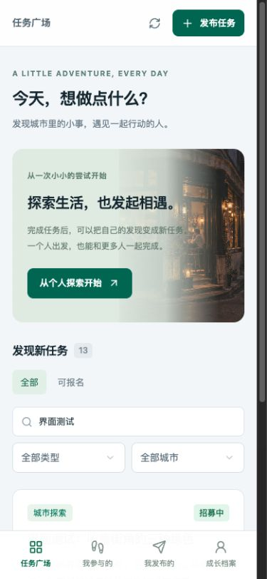
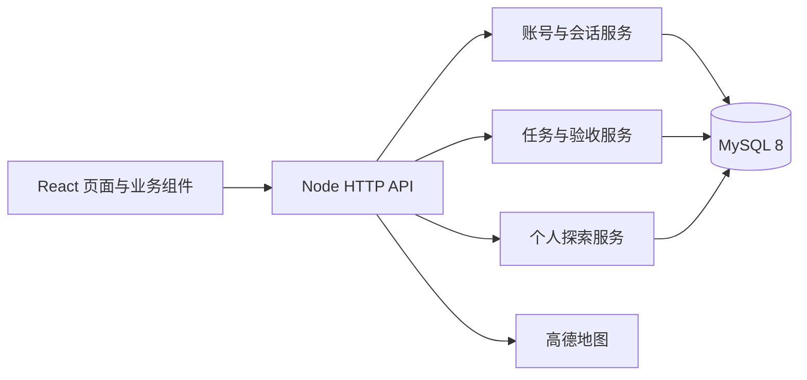

# 人生 NPC

一个把现实探索变成任务、让用户能够参与并发起活动的响应式 WebApp。当前版本使用独立账号体系和 MySQL 8，任务支持多人参与、截止时间、完成提交、发布者验收和成长奖励。

## 界面预览与文档



截图来自本机实际运行的应用，账号、任务和记录均为测试数据。查看 [完整截图与操作说明](docs/SCREENSHOTS.md)。

| 文档 | 内容 |
| --- | --- |
| [产品使用说明](docs/PRODUCT.md) | 注册、发布、多人参与、提交与验收 |
| [架构与业务规则](docs/ARCHITECTURE.md) | 模块边界、状态机、并发与权限 |
| [数据库说明](docs/DATABASE.md) | MySQL 表、索引、迁移与存储 |
| [API 说明](docs/API.md) | 请求方式、字段、返回值与错误码 |
| [部署与配置](docs/DEPLOYMENT.md) | 本机启动、国内服务器、HTTPS 与备份 |
| [测试记录](docs/TESTING.md) | 42 项集成检查、界面验证与未验证项 |
| [SQL 文件](docs/sql/README.md) | 空库结构快照、只读检查语句 |

## 运行

首次克隆后先执行 `npm ci`，复制 `.env.server.example` 为 `.env.server`，设置随机数据库密码，并同步修改 `MYSQL_URL`。真实配置不会提交到 Git。

```sh
docker compose --env-file .env.server up -d mysql
npm run db:migrate
npm run api:dev
# 另一个终端
npm run dev
```

打开 http://127.0.0.1:5173 并注册自己的账号。完整部署步骤、HTTPS、数据库备份和环境配置见 [部署说明](docs/DEPLOYMENT.md)。

## 产品流程

- 注册账号 → 保存一次性恢复码 → 登录。支持修改密码、恢复码找回和退出登录；不再依赖 ChatGPT 账号。
- 任务广场：按类型、城市、标题、地点或发起人筛选。
- 我参与的：报名 → 保存私人草稿/附件 → 截止前提交 → 等待验收 → 通过或退回补充。
- 我发布的：保存/编辑草稿 → 发布 → 多人报名 → 逐人验收。可以停止新报名，或说明原因后取消任务。
- 完成后：成长档案增加经验值，并提供“发布类似任务”入口。发布不以先完成任务为前提。
- 保留个人探索、能力扫描、地图、照片/录音、收藏、城市活动和双人真人邀请，位于 `/explore`。

## 业务规则

任务和个人参与记录分别建模。每个社区任务有 1–100 个名额、完成要求、公开地点和截止时间。每个用户对同一任务只能有一条参与记录，但可以同时参加不同任务。退出释放名额，重新报名复用自己的记录。发布者不能参加自己的任务。

发布后完成要求固定，修改内容需复制为新任务。停止招募只阻止新报名；已报名者仍可按期提交。截止时间由服务器判断，既检查每次操作，也由周期维护收敛状态；截止后已提交记录仍然可验收；全部验收处理完后归档为“已结束”。退回需要填写原因，截止前可补充后重新提交。存在待验收记录时不能取消，避免抹掉已提交的劳动。取消保留已完成记录与奖励。

验收通过每人获得固定 20 XP；成长值使用独立流水和参与记录唯一键保证不重复发放。个人探索默认领取后 24 小时截止，双人邀请共享同一截止时间，原探索奖励保留。每 100 XP 升一级。

## 架构



- `components/life/`：注册登录、任务编辑、详情与卡片；`app/page.tsx` 组织工作空间和视图。
- `server/index.ts`：HTTP 边界、请求体上限、身份上下文、路由和静态页面托管。
- `server/auth.ts`：scrypt 密码哈希、持久会话、恢复码轮换、数据库限流。
- `server/community.ts`：任务状态机、名额事务、私有草稿、完成验收与 XP 流水。
- `server/db.ts`：MySQL 连接池、参数化查询与连接级事务；锁定任务行后检查名额，避免并发超员。
- `server/exploration.ts`：保留的个人探索业务，已改用同一个 MySQL 仓库。
- `server/media.ts`：附件权限、格式与大小检查；`media_objects` 保存二进制内容，`media` 保存元数据。
- `server/migrations/`：版本化 MySQL 迁移与校验和。旧 `db/`、`drizzle/` 属于历史 D1 版本，不再作为新业务数据源。

数据库内保存账号、会话哈希、资料、任务、参与记录、任务动态、经验流水、探索记录及附件。前端 localStorage 只用于个人探索的设备主题偏好。附件当前与业务一同保存在 MySQL；规模扩大时可以通过存储仓库接口迁到国内对象存储，当前没有接入 OSS/COS。

旧 Sites 线上预览保持旧版，D1/R2 数据没有删除或自动迁移。新国内服务器尚未提供，因此不能声称新版本已经上线。仓库保留可选 Sites UI 网关，需要 `API_BASE_URL` 指向实际 Node 后端，网关不会回退到旧 D1。

## 验证

```sh
npm run lint
npx tsc --noEmit
npm run test:mysql
npm run build:app
```

测试直接连接本机真实 MySQL，不使用内存数据库替代。结果见 `tests/latest-mysql-results.json`。测试账号以 `qa_` 开头，任务文案明确标识测试；不会写入线上数据。旧 `tests/api.integration.mjs` 是历史 D1 测试，不能用于新版认证。

## 当前交付边界

- 已实现响应式 WebApp，尚无原生 APK/iOS 包。
- 注册是账号密码方式，找回使用恢复码；未接短信/邮件服务。
- 高德 JS Key 和安全密钥仍需配置，真实手机 GPS/麦克风需设备验证。
- 尚无平台级仲裁、审核后台和消息推送；用户任务的完成验收由发布者执行。
- 数据库迁移不能只按昵称把旧 ChatGPT 用户对应到新账号，应先验证身份映射。
