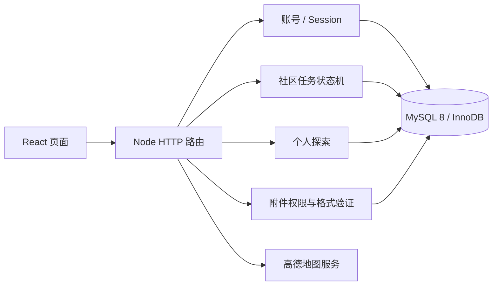
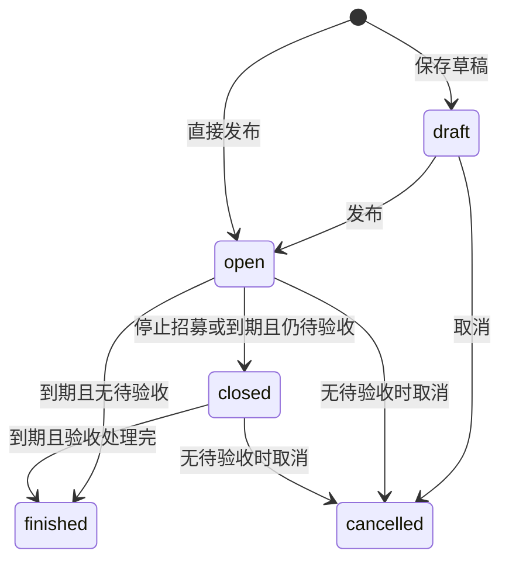

# 架构与业务规则

## 运行边界

生产独立部署时 Node 同时托管静态前端和 API，浏览器使用同源请求。开发时 Vite 将 `/api` 和 `/_AMapService` 代理到本机 Node。可选 Sites 网关通过 HTTP 转发到 Node；MySQL 不直接暴露给浏览器，也不回退到 D1。

## 模块划分

| 模块 | 职责 |
| --- | --- |
| `app/page.tsx` | 工作空间、导航、筛选、成长视图 |
| `components/life/auth.tsx` | 注册、登录、恢复码界面 |
| `components/life/task-editor.tsx` | 草稿编辑和发布表单 |
| `components/life/task-detail.tsx` | 参与、提交、验收和取消 |
| `components/life/task-card.tsx` | 任务摘要与状态 |
| `lib/community-client.ts` | 客户端 API 与展示格式 |
| `server/index.ts` | HTTP 边界、来源检查、身份上下文、静态文件 |
| `server/auth.ts` | 密码哈希、会话、恢复码与尝试次数限制 |
| `server/community.ts` | 任务状态转移与奖励流水 |
| `server/exploration.ts` | 个人探索和真人邀请 |
| `server/media.ts` | 附件读写权限、类型、容量验证 |
| `server/db.ts` | 连接池、参数化查询、连接级事务 |

## 任务与参与分离

每个任务有多个独立 `participations`。参与状态为 joined（进行中）、submitted（待验收）、approved（通过）、rejected（待补充）、withdrawn（退出）、expired（逾期）、cancelled（取消）。不能把多人参与共用同一条“已完成”记录。

## 并发与一致性

- 所有名额变化在事务内锁定任务行，再读取人数并写入报名记录，保证最后一个名额只有一位用户获得。
- `(task,user)` 唯一约束防止重复占位；退出后复用记录。
- 验收锁定任务和参与记录，仅允许从 submitted 转移。
- XP 流水的 participation 唯一键确保重复验收不会重复奖励。
- 状态变更和奖励在同一个事务提交；失败回滚。
- 截止时间在操作时校验，定时维护用于状态归档，不能仅依赖前端倒计时或定时器。
- Read Committed 隔离与连接级事务保证一组操作使用同一数据库连接。

## 权限

密码使用带盐 scrypt；会话 Cookie 为 HttpOnly、SameSite=Lax，正式 HTTPS 部署启用 Secure。数据库只保存会话 token 和恢复码的哈希。写请求必须来自配置的来源。

任务发布者不能参与自己的任务。私人草稿、附件和 GPS 记录按身份控制。发布者仅能看到提交后的参与内容，其他参与者不可读。恢复账号后旧会话全部失效。

## 扩展位置与已知限制

目前一个列表接口最多返回 500 项，客户端筛选；大规模运营需要改为服务端分页与筛选。附件现存 MySQL，容量增大时可替换存储仓库为国内对象存储。短信登录、消息推送、仲裁和平台审核尚未实现，不能把预留接口视为已经接入。
