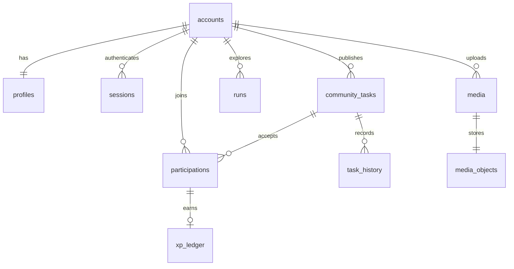

# MySQL 数据库

正式数据库为 MySQL 8 / InnoDB / utf8mb4。时间统一存储为 Unix 毫秒，页面日期按北京时间展示（发布表单按设备时区录入后转为时间戳）。

| 表 | 主要内容与约束 |
| --- | --- |
| accounts | 自主账号、密码哈希、恢复码哈希；username 唯一 |
| sessions | 会话 token 哈希、用户、过期时间 |
| auth_limits | 持久化尝试次数窗口 |
| profiles | 昵称、角色、城市、能力扫描答案、同城发现开关 |
| community_tasks | 发布者、内容、完成要求、名额、截止和状态 |
| participations | 每人每任务一条记录，`UNIQUE(task,user)` |
| task_history | 状态变化、操作者和相关参与记录 |
| xp_ledger | 验收奖励流水，participation 唯一 |
| runs | 个人探索及双人邀请，含独立截止时间 |
| favorites | 用户收藏，联合主键 |
| events | 城市探索计划 |
| media | 附件元数据、所属记录、类型与大小 |
| media_objects | 附件二进制内容，MEDIUMBLOB |
| schema_migrations | 迁移文件名、校验和与应用时间（迁移器管理） |

图中是业务关系；`media.run` 可指向个人探索或社区参与记录，所以附件所属记录由服务层校验，而不是单一表外键。

## 迁移

正式迁移源在 `server/migrations/`：

1. `001_mysql.sql` 创建账号与业务表。
2. `002_exploration_deadlines.sql` 为个人探索增加并回填截止时间。

运行 `npm run db:migrate`。迁移器取得数据库锁、校验已有迁移内容，按顺序应用新文件。不要修改已应用的历史迁移。MySQL DDL 不能整文件事务回滚；失败需核对数据库状态后修复。

`docs/sql/schema.mysql.sql` 是同一批迁移的结构快照，方便审阅和在空库手工初始化；它不包含用户数据，也不会写入迁移器的版本记录。不要先手工执行快照再运行迁移器，否则会重复建表。应用部署优先使用迁移器。

## 存储和备份

本机 Compose 使用 `life-npc_mysql_data` 命名卷。重建应用不会删除卷；不要运行带 `-v` 的销毁命令。备份需包含 BLOB，建议 `mysqldump --single-transaction --hex-blob`，使用受限配置文件提供密码。实际备份应加密并保存在独立位置，恢复演练使用单独数据库。

旧 D1/R2 和 `.wrangler/state` 不会自动迁移到 MySQL。旧用户与新账号需要经过验证的身份对应关系，不可只按昵称绑定。
