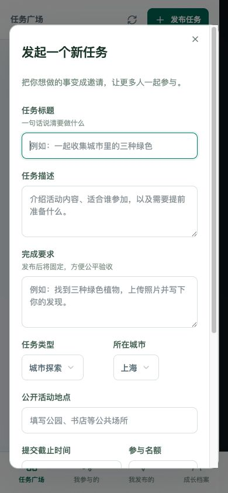
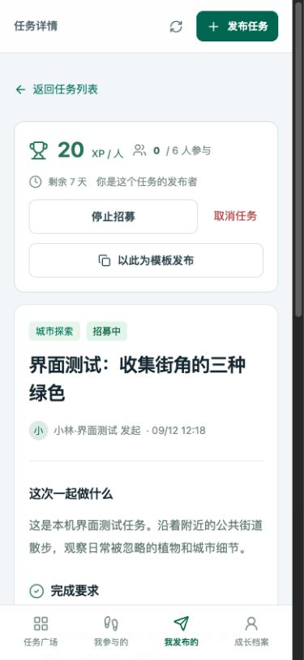
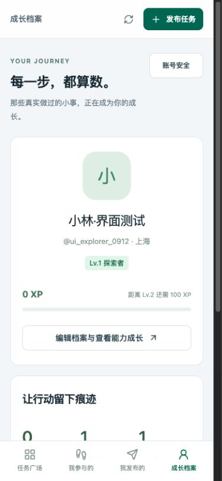
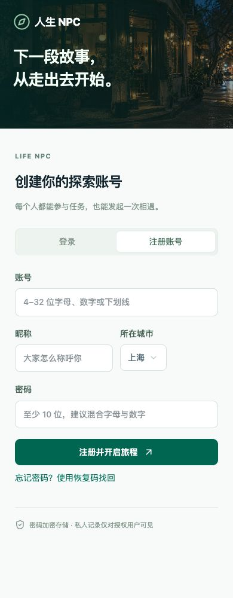

# 手机界面截图与说明

以下图片于 2026-09-12 从本机实际运行的应用以 390 像素宽手机视口截取。账号“小林·界面测试”及任务均为测试数据。所有截图均为手机界面。

## 1. 任务广场

底部导航提供任务广场、我参与的、我发布的和成长档案四个入口，右上角可随时发布任务。向下滑动可搜索任务、按城市和类型筛选，并查看截止时间和参与名额。

## 2. 发布任务

填写标题、描述和完成要求，向下滑动继续设置城市、公开地点、截止时间与名额。支持先保存草稿再发布，每人独立提交与验收。

## 3. 任务详情

管理操作和任务说明纵向排列。图中是发布者视角，可停止招募、取消任务，或以此为模板发起新任务。向下滑动查看完成要求和参与验收区。

## 4. 成长档案

展示昵称、城市、经验值、等级与参与概况。经验值来自个人探索和社区任务验收记录；测试账号尚未通过验收，因此为 0 XP。

## 5. 独立账号注册

填写账号、昵称、城市与密码即可注册；切换“登录”可使用已有账号。注册后显示一次性恢复码，供用户保存以便找回账号。本图仅展示空白注册表单。

