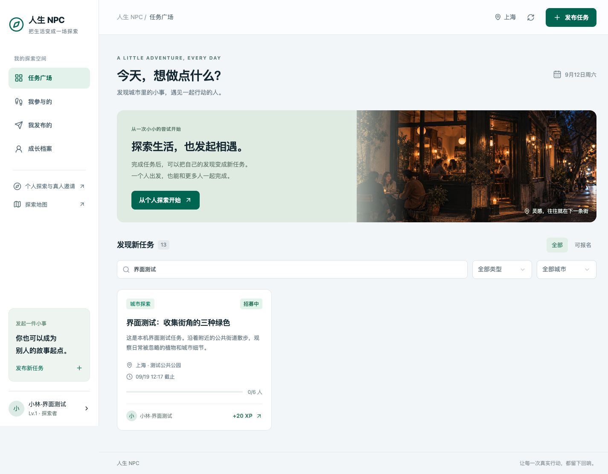
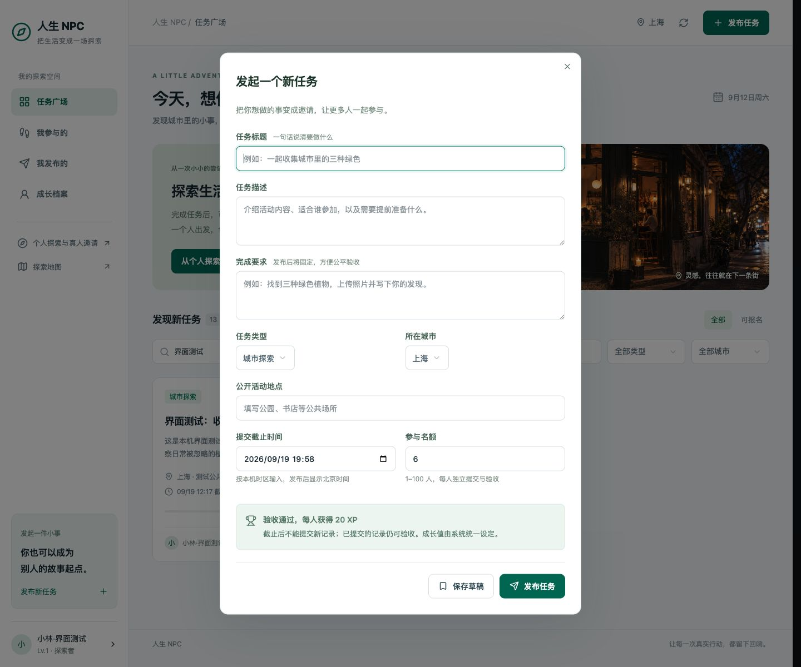
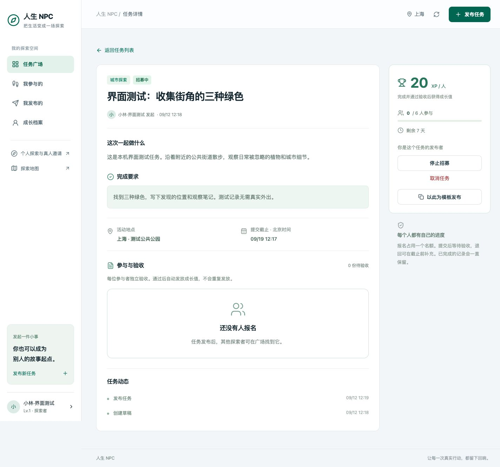
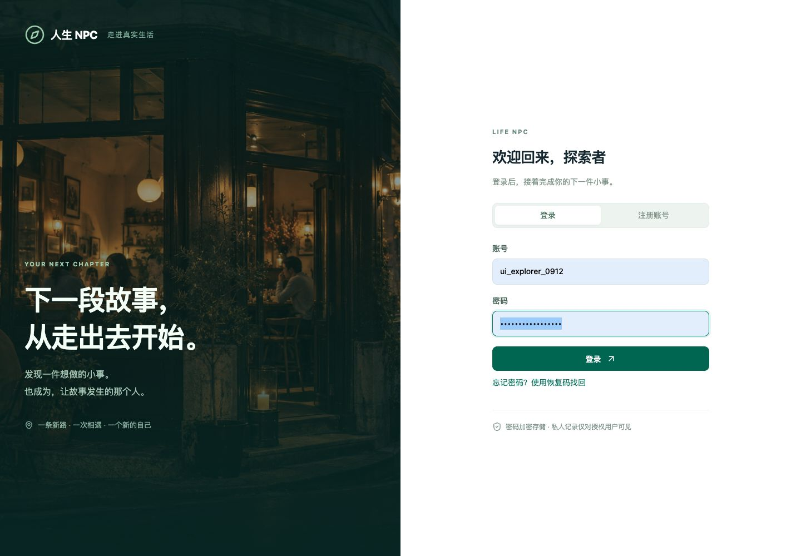

# 界面截图与说明

以下图片于 2026-09-12 从本机实际运行的应用截取，没有使用设计稿替代。账号“小林·界面测试”及任务均是测试数据。任务广场使用“界面测试”关键词筛选，以便清楚展示一张任务卡片；顶部总数是列表的总任务数。

## 1. 桌面任务广场

左侧导航区分发现任务、个人参与、自己发布和成长档案。右上角提供发布入口，任务卡片显示公开地点、截止时间、名额和奖励。页面支持搜索、城市和类型筛选；“可报名”排除本人发布及已经参与的任务。

## 2. 发布任务

一次表单填写标题、描述、完成要求、城市、公开地点、截止时间和名额。可保存草稿后再发布。发布时间和截止时间由服务器校验；发布后固定完成要求，避免参与者按旧要求完成后产生争议。

## 3. 任务详情与发布者管理

左侧展示任务内容、要求、参与记录及动态，右侧集中显示奖励、名额与管理操作。“停止招募”保留已有参与者的提交资格；“取消任务”需要原因，并且必须先处理待验收记录。

## 4. 手机任务详情

手机端将操作区和任务说明纵向排列，底部固定四个主导航入口。参与者在自己的记录区提交，发布者在参与与验收区处理结果。图中是发布者视角。

## 5. 手机成长档案

展示昵称、城市、经验值、等级和参与概况。经验值来自真实任务完成记录与社区验收流水，不是浏览器中的临时计数。测试账号尚未通过验收，因此图中为 0 XP。

## 6. 独立账号登录

账号与 App 自己的 MySQL 数据绑定，不要求 ChatGPT 登录。支持账号密码登录和恢复码找回。图中输入框为空，不包含密码或恢复码。

## 7. 手机注册

填写账号、昵称、城市和密码即可注册。注册后显示一次性账号恢复码，用户保存后进入应用。本截图只展示注册表单。

